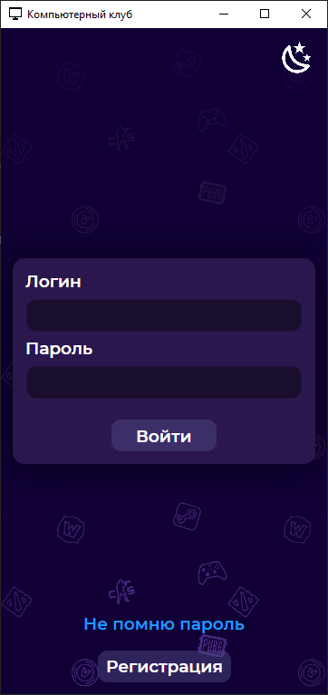
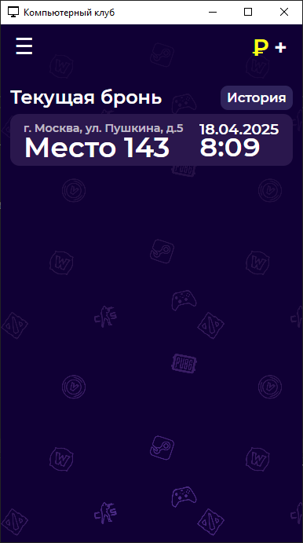
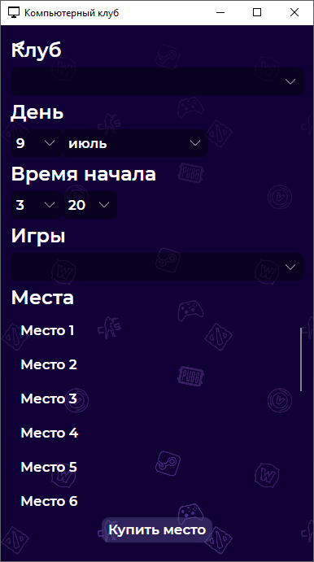
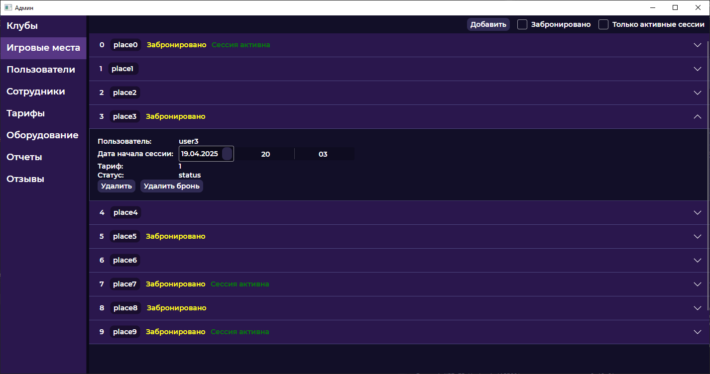
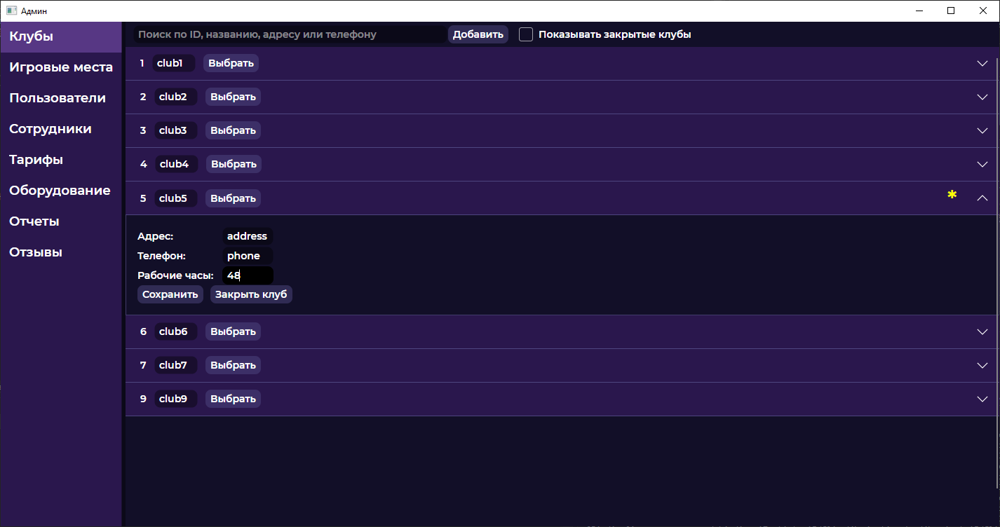
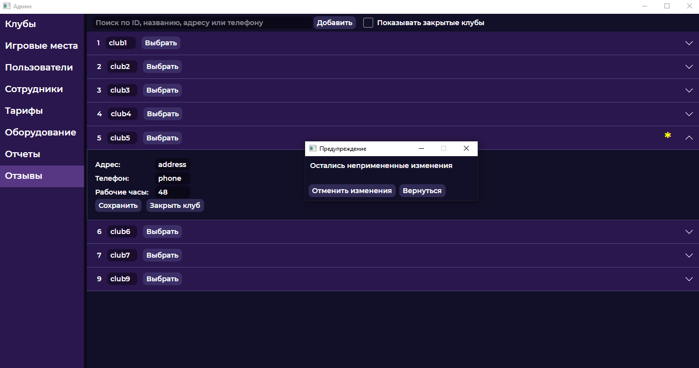

# Клиентская часть информационной системы для сети компьютерных клубов
## Проекты
### CompClubGUI.Android / CompClubGUI.Desktop
Мобильное / десктопное приложение для клиентов клуба. Позволяет авторизоваться, резервировать место в клубе, просматривать историю посещений, пополнять баланс, просматривать его историю, оставлять отзыв.

### CompClubGUI.Admin
Десктопное приложение для сотрудников клуба. Позволяет просматривать, изменять, удалять и добавлять:
- данные клубов (для владельца сети клубов)
- игровые места в клубе, информацию о текущей брони места и активной сессии
- данные пользователей
- данные сотрудников
- тарифы (для отдела продаж)
- оборудование
- формирование отчетов (в разработке)
- отзывы (в разработке)

### CompClubGUI.InternalApp
Десктопное приложение для игровых компьютеров. Позволяет клиенту начать сессию и запустить игровой лаунчер.
(в разработке)
